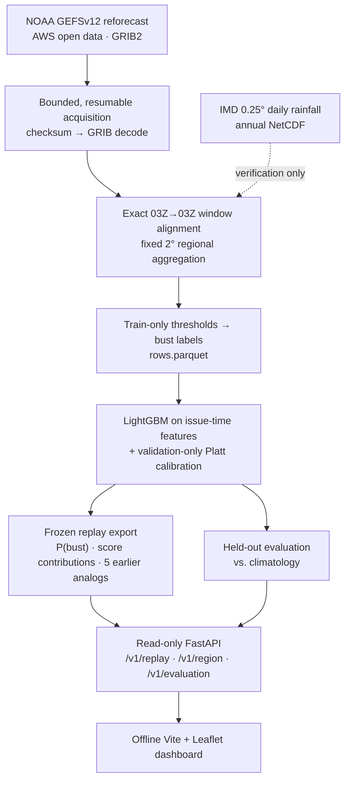

<div align="center">


# Synoptiq
### Forecast reliability, made inspectable

**Flag the forecast that deserves a second look: a calibrated bust-risk layer for medium-range rainfall forecasts over India.**

Built by **HackTastic 6ix** for Smart India Hackathon 2026 · Problem Statement SIH26079

[](https://www.python.org)
[](https://fastapi.tiangolo.com)
[](https://lightgbm.readthedocs.io)
[](https://leafletjs.com)
[](#9-data-sources)
[](#11-installation)
[](#1-project-information)
[](LICENSE)

[Project Reference](docs/SYNOPTIQ.md) · [Architecture & Science](docs/SYNOPTIQ.md#7-architecture-and-technology) · [Evaluation Results](docs/SYNOPTIQ.md#9-recorded-evaluation) · [Audit & Verification](docs/SYNOPTIQ.md#5-time-alignment-and-spatial-coverage)

</div>

---

> [!IMPORTANT]
> **Scope:** GEFSv12 reforecast research prototype; not NCUM/NEPS operational validation.
> Synoptiq replays historical forecasts. It is not a live warning service and does not produce a new rainfall forecast.

> [!TIP]
> ### Evaluator quickstart
> * **Run it locally in about 5 minutes:** see [Installation](#11-installation) and [Run](#12-run). No GPU, no cloud account, no API keys.
> * **Headline result:** on held-out 2018–19 forecasts, the calibrated model's Brier score is **0.03049**, compared with **0.04359** for climatology. That is about a **30% lower Brier score** ([details](#6-results)).
> * **Walkthrough case:** region `R28N-094E`, forecast issued 2019-12-31. Bust risk rises from **1.54%** on Day 1 to **65.44%** on Day 6, and Day 6 did bust ([see case](#replay-walkthrough)).

---

## Contents

1. [Project Information](#1-project-information)
2. [Problem Statement](#2-problem-statement)
3. [Proposed Solution](#3-proposed-solution)
4. [Key Features](#4-key-features)
5. [How It Works](#5-how-it-works)
6. [Results](#6-results)
7. [Technology Stack](#7-technology-stack)
8. [Architecture](#8-architecture)
9. [Data Sources](#9-data-sources)
10. [Repository Structure](#10-repository-structure)
11. [Installation](#11-installation)
12. [Run](#12-run)
13. [Team Details](#13-team-details)
14. [Future Scope and Limitations](#14-future-scope-and-limitations)
15. [FAQ](#15-faq)
16. [Conclusion and Impact](#16-conclusion-and-impact)
17. [Sources](#17-sources)

---

## 1. Project Information

- **Project Title:** Synoptiq: AI-based forecast bust detection
- **PS ID:** SIH26079
- **PS Title:** AI-Based Forecast Bust Detection for Medium-Range Weather Forecasts
- **Organisation:** Ministry of Earth Sciences (MoES)
- **Category:** Software
- **Theme:** Smart Automation
- **Team:** HackTastic 6ix (Team ID 67)

---

## 2. Problem Statement

Numerical weather models are usually reliable, but occasionally a medium-range rain forecast misses badly. Small errors in the starting state grow with lead time. Some regimes are also harder to predict, including monsoon depressions, western disturbances, active/break monsoon phases and tropical cyclones.

* **Spread is not enough:** ensembles show uncertainty, but members can agree and still be wrong.
* **Too much to scan:** a reviewer cannot inspect every region of India at every lead day by hand.
* **No record of when to doubt:** there is no quick way to see how often similar forecasts went wrong before.

Operational ensembles such as NCMRWF's NEPS (1 control + 22 perturbed members) are institutional context here. The prototype itself is trained and tested on the public GEFSv12 reforecast.

**The ask, in our framing:** before observations arrive, tell reviewers *which region's Day-N rain forecast is unusually likely to be wrong*, show *why*, and show *how often that signal has been right before*.

---

## 3. Proposed Solution

Synoptiq is a research prototype for identifying the risk that a regional daily-rainfall forecast will be a **forecast bust**, meaning it will have an unusually large error. It replays historical NOAA GEFSv12 forecast issue times against IMD gridded rainfall. For each fixed 2° Indian land region and lead day, it returns a bust probability, the model evidence behind it, earlier comparable cases, and a full provenance trail.

It does not produce a new rainfall forecast. It is a reliability layer on top of an existing one, so it complements a forecast centre's models instead of competing with them.

> *Given a GEFS forecast that was available at issue time, we estimate where its rain forecast is unusually likely to fail, explain which measurable signals drove that estimate, and show whether those probabilities matched subsequent observations.*

- **Issue-time only:** the model sees only what was known when the forecast was issued. Observations are used later, for labels and verification.
- **Region-aware bust label:** "unusually wrong" is judged against each region's own history for that season and lead.
- **Evidence, not a black box:** every score comes with model-score contributions, up to five earlier comparable forecasts and their real outcomes, and the source file and UTC window.
- **Honest evaluation:** a frozen chronological split, a validation-only calibrator and a climatology baseline are compared on untouched test years.

---

## 4. Key Features

- **National bust-risk map:** 2° land regions coloured by bust probability, with a Day 1–10 selector and explicit gray no-data cells.
- **Region inspector:** probability, threshold, exact UTC window, coverage, forecast vs. observed rain, and a lead-day probability curve.
- **"Why flagged?" evidence:** per-feature model-score contributions turned into plain-language captions.
- **Earlier comparable cases:** up to five strictly earlier forecasts with their real errors and bust outcomes.
- **Trust panel:** reliability diagram, Brier scores and sample counts from the held-out evaluation.
- **Full provenance:** the source GRIB key, accumulation arithmetic and UTC interval behind every score.
- **Read-only API:** GeoJSON map, region detail and evaluation endpoints with interactive `/docs`.
- **Offline dashboard:** Vite + Leaflet with bundled assets. No map tiles or CDN, so it runs without an internet connection once built.
- **Disk-bounded data pipeline:** about 98 GB of forecast archive streamed through an 8 GiB working budget, with checksums and resumable state.

Boosted trees, calibration, SHAP, ensemble spread and analog methods are established techniques. Synoptiq's contribution is combining them into an auditable workflow for Indian regional rainfall busts. It does not claim to be the first or only such approach.

---

## 5. How It Works

### What counts as a bust

**One prediction** = `(00 UTC initialization date, lead day, fixed 2° region)`.

| Term | Definition |
| --- | --- |
| Forecast `F` | GEFSv12 **control member (c00)** 24-hour rainfall, regional mean, over the audited verification window |
| Observation `O` | IMD 0.25° daily gridded rainfall, mean of the region's valid land points over the matching window |
| Error | `abs(F − O)` in mm/day. Overforecasts and underforecasts both count |
| Threshold | `max(q90 of training-year errors for that region × season × lead bucket, 10 mm)` |
| Bust | `error > threshold` (strict greater-than) |

Seasons are `JJAS` (June–September) and `other`. Lead buckets are `1–3`, `4–7` and `8–10`. Thresholds are fit on **training years only**, so a 20 mm miss in Rajasthan is not treated the same as a 20 mm miss in the Meghalaya monsoon. The 10 mm floor is a declared research policy, not an official IMD warning criterion. Because thresholds are frozen, the realised bust rate in later years need not be exactly 10%.

The API also reports `1 − P(bust)` as a complement for this defined event only. It is not a general accuracy or safety score.

### Audited time alignment

IMD's daily value ends at 03:00 UTC (08:30 IST), while GEFS runs start at 00 UTC. Each lead day is therefore scored over an exact 03Z→03Z window built from GEFS accumulation steps, never a naive 00Z→00Z total:

```text
IMD date label D      →  [D − 1 day 03:00Z, D 03:00Z)
GEFS 00 UTC, lead L   →  [init + (24L − 21) h, init + (24L + 3) h)
```

The mapping was hand-checked on real files. At 20°N, 78°E for the 2018-08-01 run, eight 3-hour GEFS slices sum to 8.24 mm, and the repository's `exact_24h_total` returns the same 8.24 mm ([docs/SYNOPTIQ.md §5](docs/SYNOPTIQ.md#5-time-alignment-and-spatial-coverage)).

**Day 10 is unavailable.** Its window needs the +240→+243 h amount, but past +240 h the archive switches to a single +240→+246 h step. Splitting that step would be a guess, so Day 10 returns explicit no-data rather than an approximation (decision D-005).

### Regions and coverage

The fixed 2° grid has **112** regions that intersect India's land area. Each full cell holds an 8×8 block of IMD 0.25° points. A region is scored only if its IMD coverage is **≥ 80%**: **65** are supported, and **47** peripheral regions are shown as explicit no-data rather than zero risk. Region IDs encode cell centres (for example, `R28N-094E` is centred on 28°N, 94°E); they are not districts. Working at 2° also avoids counting a storm displaced by a few grid cells as a failure twice.

---

## 6. Results

### Current status

The historical-data pipeline, trained candidate model, held-out evaluation, and real replay dashboard are complete (roadmap Phases 1–3, tag `e2e-v1`; see [docs/SYNOPTIQ.md §13](docs/SYNOPTIQ.md#13-development-history-and-completion-status)).

| | |
| --- | --- |
| **Forecast data** | 3,652 daily 00 UTC GEFSv12 c00 initializations (2010-01-01 to 2019-12-31) |
| **Observations** | 11 IMD annual files, 2010–2020 (2020 is verification-only for late-2019 forecasts) |
| **Aligned rows** | 4,090,240 (3,652 dates × 112 regions × 10 leads) |
| **Model** | **Reduced c00-only candidate** (decision D-008): CPU LightGBM, five issue-time inputs, seed 42 |
| **Calibration** | Sigmoid (Platt), fit on validation years only |
| **Split** | 2010–15 train · 2016–17 validation/calibration · 2018–19 held-out test. No random row split |

### Held-out performance

On the frozen **2018–2019 test** set: 427,050 eligible Day 1–9 region/lead verifications, with a bust rate of 4.74%.

| Model | Brier score (lower is better) |
| --- | ---: |
| Train-only climatology baseline | 0.04359 |
| Reduced c00 candidate, calibrated | **0.03049** |
| Reduced c00 candidate, uncalibrated | 0.02949 |

The calibrated candidate cuts the Brier score by about **30.1%** compared with climatology (Brier skill ≈ 0.30). Calibration was fit on validation years only, as the policy requires, but it did **not** improve the held-out Brier score in this run. The reliability curve is also not perfectly calibrated. Rows are correlated across dates, regions and leads, so this is not a count of independent storms.

**Evaluation plan for the full model:**
- Brier skill against climatology and against a spread-only baseline.
- Reliability diagrams with sample counts.
- PR-AUC and recall at a fixed alert budget (the top 10% of region-days).
- Slices by lead bucket and season.
- Ablations of the analog and physical feature groups.
- Week-block bootstrap intervals.

If a model does not beat climatology, that result is reported rather than hidden. Full details: [docs/SYNOPTIQ.md §9](docs/SYNOPTIQ.md#9-recorded-evaluation).

---

## 7. Technology Stack

| Layer | Technology | Purpose |
| --- | --- | --- |
| **Runtime** | Python 3.11 | CPU-first local execution; no GPU required |
| **Data acquisition** | Requests, SQLite | Bounded, resumable archive download with persistent progress state |
| **Decoding** | cfgrib, ecCodes, xarray | GRIB2 forecasts and NetCDF observations as labelled arrays |
| **Tables & storage** | NumPy, pandas, PyArrow/Parquet, JSON | Aligned rows, model metadata, metrics and replay assets |
| **Model** | LightGBM, scikit-learn | Gradient-boosted bust classifier, sigmoid calibration, evaluation |
| **Explainability** | LightGBM contributions (TreeSHAP), SHAP | Per-feature model-score evidence |
| **API** | FastAPI, Pydantic, Uvicorn | Typed, read-only REST API with OpenAPI `/docs` |
| **Dashboard** | Vite, Leaflet, plain JS/CSS | Offline map with locally bundled assets |
| **Quality** | pytest, Ruff, Make | Leakage, time-window, label and API-contract tests; reproducible targets |

---

## 8. Architecture



The dotted arrow marks where IMD observations enter. They are used only to build historical labels and to verify results, never as model inputs.

### Model and features

**Current candidate.** LightGBM is trained on five issue-time inputs: `f_control_mm`, `region_id`, `season`, `lead_day` and `lead_bucket`. Settings are 100 trees, 31 leaves, learning rate 0.05, and a minimum of 50 samples per leaf. The sigmoid calibrator is fit on 2016–17 only.

**Full Synoptiq design.** The design extends the model to roughly 15–25 named issue-time quantities:
- **Ensemble disagreement:** the five-member ensemble (c00 + p01–p04), with rain spread and wet-member fraction.
- **Moisture:** precipitable water and 850 hPa humidity.
- **Circulation:** sea-level pressure minimum, 850 hPa wind and 500 hPa height.
- **Forecast rain:** regional mean and upper-quantile rain.
- **Analog-error memory:** the mean error and bust fraction of the most similar earlier forecasts.

The spread-only baseline and these feature groups are evaluated once that corpus is acquired. The dashboard marks their preview cards as **Illustrative**. The full design also compares an unweighted model with a moderately class-weighted one before calibration.

### Explanations and analogs

- **Score evidence.** Each score is broken into per-feature contributions to the raw tree score (LightGBM's native TreeSHAP-style contributions). They are grouped as forecast rain, regional context and lead/season now. With the full design, [config/reason_groups.yaml](config/reason_groups.yaml) adds moisture, circulation, ensemble disagreement and analog-error memory. The top groups become plain-language captions. These are **model-score evidence**, not proof of a meteorological cause.
- **Analog cases.** Synoptiq retrieves up to five forecasts that are strictly earlier than the query. They come from the training-era pool, with the same region, season and lead bucket, and are ranked by forecast similarity. Each case's real error and bust outcome is shown as context. If fewer than five qualify, the response says `insufficient_earlier_analogs` instead of padding the list.

### Design choices

**Start here:** [Synoptiq — Project Reference](docs/SYNOPTIQ.md) brings together the problem, scientific method, architecture, recorded results, current capabilities, development history, and future roadmap in one document.

## Current status

The recorded real-data MVP uses a **reduced c00-only LightGBM candidate**, with a completed 2010–2019 forecast corpus, held-out evaluation, and a three-date historical replay. Exact Days 1–9 are supported; Day 10 and low-coverage regions remain no-data. Full ensemble/atmospheric features and final release acceptance remain outstanding; see the [project reference](docs/SYNOPTIQ.md#3-current-implementation) for scope and evidence.

A fresh clone still runs in **fixture mode** by default. Real generated artifacts are Git-ignored and must be supplied separately; the [real-replay startup instructions](docs/SYNOPTIQ.md#12-repository-and-local-operation) explain how to select them. Fixture values are not model results.

## 9. Data Sources

| Dataset | Role | Status |
| --- | --- | --- |
| NOAA GEFSv12 reforecast (AWS, no login) | The forecast being audited. 00 UTC, 5 members, 2000–2019, 0.25° to Day 10 | **Used.** 2010–2019 control-member rain acquired and decoded |
| IMD 0.25° daily gridded rainfall (IMD Pune, 1901–2024) | Verification reference | **Used.** 2010–2020 annual files decoded |
| ERA5 reanalysis | Optional atmospheric context | Not needed for the current model |
| TIGGE (includes NCMRWF and IMD contributions) | Possible multi-centre retraining | Future; CC BY-NC terms, 48 h delay, needs separate training |
| IMDAA regional reanalysis | Reference-sensitivity check | Future; requires login approval |
| IMD 1° daily Tmax | Separate heat-wave task | Future; needs its own label |
| NASA IMERG | Ocean/reference sensitivity | Future; not interchangeable with IMD land rain |
| NCMRWF NCUM/NEPS historical fields | Operational transfer target | No confirmed historical access; would require retraining and recalibration |
| Recent GFS/ECMWF open feeds | Inspection only | Rolling retention; unusable as a training corpus |

Every downloaded file's source key, checksum, size and decoded metadata is recorded in [DATA_MANIFEST.csv](DATA_MANIFEST.csv).

### Data and safety contract

- Do not commit raw datasets, credentials, or absolute data paths.
- Use `DATA_DIR` to point at local data storage (defaults to `data/`). See [.env.example](.env.example).
- The frozen target is regional 24-hour rain error, with train-only thresholds and explicit UTC verification windows.
- Day 10 is unavailable: the audited target requires a +240–+243-hour amount, while the inspected archive supplies +240–+246 hours. See [docs/SYNOPTIQ.md §5](docs/SYNOPTIQ.md#5-time-alignment-and-spatial-coverage); do not present a Day-10 value as exact without a new approved audit.
- Thresholds, climatology, the analog library and calibration use only their permitted earlier periods; the 2018–19 test years are never used for fitting or tuning.
- Any change to source, time window, split, threshold, region grid, or feature policy needs a dated entry in [docs/SYNOPTIQ.md §13](docs/SYNOPTIQ.md#13-development-history-and-completion-status). See also [DATA_MANIFEST.csv](DATA_MANIFEST.csv) and [docs/SYNOPTIQ.md §14](docs/SYNOPTIQ.md#14-quality-reproducibility-and-release) for change control.
- Explanations are **model-score evidence**, not proven meteorological causes. Analog cases are always strictly earlier than the forecast being scored.

---

## 10. Repository Structure

`src/bust/` contains the data, feature, model, and API packages. `data/fixtures/` is the only committed data directory. Research, decisions, audit evidence, results, and the implementation roadmap are consolidated in [`docs/SYNOPTIQ.md`](docs/SYNOPTIQ.md).

```text
synoptiq/
├── README.md                # Project overview (this file)
├── LICENSE                  # MIT License
├── DATA_MANIFEST.csv        # Provenance of every source file used
├── Makefile                 # Named pipeline, server, test and lint targets
├── pyproject.toml           # Python package and dependencies
├── requirements.lock        # Resolved dependency lock
├── environment.yml          # Conda fallback for GRIB bindings
├── .env.example             # Local configuration template
├── config/                  # Label policy, splits, 2° regions GeoJSON, explanation groups
├── src/bust/
│   ├── data/                # Acquisition, GRIB/NetCDF decoding, alignment, regions, labels
│   ├── features/            # Issue-time forecast features, earlier-only analog retrieval
│   ├── model/               # Baseline, training, calibration, evaluation, explanations
│   └── api/                 # FastAPI app, schemas, replay store and export
├── scripts/                 # Reproducible entry points behind the make targets
├── tests/                   # Time-window, accumulation, label, leakage, model and API tests
├── web/                     # Vite + Leaflet dashboard (offline, bundled assets)
├── data/fixtures/           # Committed integration fixture (raw/interim/processed are Git-ignored)
├── artifacts/               # Generated model, metrics and replay files (Git-ignored)
└── docs/                    # Consolidated project reference (SYNOPTIQ.md)
```

### What goes where?

| Item | Location |
| --- | --- |
| Data pipeline, model and API source | [`src/bust/`](src/bust/) |
| Dashboard source | [`web/`](web/) |
| Frozen label, split, region and explanation policies | [`config/`](config/) |
| Consolidated project reference | [`docs/SYNOPTIQ.md`](docs/SYNOPTIQ.md) |
| Scientific definition and chronological splits | [`docs/SYNOPTIQ.md §4`](docs/SYNOPTIQ.md#4-scientific-definition) |
| Signed time-window, Day-10 and spatial coverage audits | [`docs/SYNOPTIQ.md §5`](docs/SYNOPTIQ.md#5-time-alignment-and-spatial-coverage) |
| Data sources, acquisition pipeline and manifests | [`docs/SYNOPTIQ.md §6`](docs/SYNOPTIQ.md#6-data-sources-and-acquisition) |
| Model, calibration and explainability | [`docs/SYNOPTIQ.md §8`](docs/SYNOPTIQ.md#8-model-calibration-and-evidence) |
| Baseline, validation and held-out evaluation results | [`docs/SYNOPTIQ.md §9`](docs/SYNOPTIQ.md#9-recorded-evaluation) |
| Decision log (D-001–D-010) and milestones | [`docs/SYNOPTIQ.md §13`](docs/SYNOPTIQ.md#13-development-history-and-completion-status) |
| Quality, reproducibility and release standards | [`docs/SYNOPTIQ.md §14`](docs/SYNOPTIQ.md#14-quality-reproducibility-and-release) |
| Source provenance manifest | [`DATA_MANIFEST.csv`](DATA_MANIFEST.csv) |

---

## 11. Installation

### Prerequisites
- Python 3.11 (the locked project target)
- Node 20+ (to build the dashboard)
- `make`
- No GPU, cloud account or API keys required

### 1. Clone the repository
```bash
git clone https://github.com/kan9667/synoptiq.git
cd synoptiq
```

### 2. Python environment
```bash
python3.11 -m venv .venv
source .venv/bin/activate
python -m pip install --upgrade pip
python -m pip install -e '.[dev]'
```

For environments where GRIB bindings are difficult to build (common on macOS), use `conda env create -f environment.yml` and `conda activate synoptiq`.

### 3. Build the dashboard
```bash
make web
```

---

## 12. Run

### Start the API and dashboard (fixture mode)
```bash
make api
```
- Dashboard: `http://127.0.0.1:8000`
- Interactive API docs: `http://127.0.0.1:8000/docs`
- Contract check: `make smoke` (runs in-process; the server does not need to be running)

A fresh clone serves the checked-in **fixture** by default. Its values are illustrative integration data, not trained-model output or performance evidence, and the dashboard shows a visible FIXTURE ribbon.

### Run the real historical replay
The real model, metrics and replay files are generated locally and Git-ignored. The replay needs `artifacts/replay/reduced_c00_replay.json` (about 15 MB) and its metadata file. You can generate them with the pipeline below, or get a copy from the team; the raw corpus is not needed just to serve them.

```bash
source .venv/bin/activate
unset SYNOPTIQ_DEMO_MODE
REPLAY_ASSET_PATH=artifacts/replay/reduced_c00_replay.json API_PORT=8001 make api
```

Open `http://127.0.0.1:8001/` and confirm that `/health` reports `data_mode=historical_replay`. The replay covers three held-out initialization dates (**2018-01-01**, **2019-01-01**, **2019-12-31**), which is 3,360 region/lead records.

#### Replay walkthrough

Region `R28N-094E`, initialization 2019-12-31:

| | Day 1 | Day 5 | Day 6 |
| --- | ---: | ---: | ---: |
| Bust probability | 1.54% | 28.83% | **65.44%** |
| GEFS control forecast | 0.02 mm | 13.03 mm | **20.16 mm** |
| IMD observed | 0 mm | 12.27 mm | **5.07 mm** |
| Outcome (threshold 10 mm) | no bust | no bust | **bust** (error 15.09 mm) |

This is one illustration; aggregate evaluation is in [Results](#6-results).

### API reference

| Endpoint | Returns |
| --- | --- |
| `GET /health` | Status and served data mode (`fixture` or `historical_replay`) |
| `GET /v1/replay?init=YYYY-MM-DD&lead=1..10` | GeoJSON `FeatureCollection` of regions |
| `GET /v1/region/{region_id}?init=...&lead=...` | Probability and its complement, forecast vs. observed, threshold, UTC window, score evidence, earlier analogs, provenance |
| `GET /v1/evaluation` | Saved held-out evaluation |
| `/docs` | Interactive OpenAPI documentation |

The map response states its `data_mode`, `model` and `truth_source`. Each region feature carries `region_id`, `p_bust`, `tier`, `threshold_mm`, `f_control_mm`, `valid_start_utc`, `valid_end_utc`, `window_quality`, `provenance` and `no_data_reason`. Unknown dates return 404 with the list of available dates. Day 10 returns `null`/unavailable, never a zero probability. Risk tiers in the current build are low < 30%, watch 30–50%, and high ≥ 50%. These are display tiers, not official warnings or calibration bins.

### All commands

| Command | Purpose |
| --- | --- |
| `make pilot` | Check local source inventory; no remote data is silently substituted. |
| `make dataset` | Build aligned rows when audited source data is available. |
| `make train` | Fit and evaluate the train-only climatology baseline (overwrites with `--replace`). |
| `make candidate` | Train the reduced c00 LightGBM candidate; refuses to overwrite existing artifacts. |
| `make evaluate-candidate` | Frozen validation calibration and held-out test evaluation; do not rerun to tune results. |
| `make replay` | Export frozen replay assets (overwrites with `--replace`). |
| `make api` | Run the fixture/replay FastAPI server. |
| `make web` | Build the offline Vite frontend. |
| `make smoke` | Exercise API endpoints and response contracts (fixture). |
| `make replay-smoke` | Same checks against the real replay asset. |
| `make demo` | Serve the illustrative guided fixture walkthrough (not real model output). |
| `make test` | Run unit and API tests. |
| `make lint` | Ruff lint over `src`, `tests` and `scripts`. |

Pipeline targets print their input manifest ID, git commit, split, seed, and output path.

The full acquisition uses a resumable streaming pipeline (`scripts/acquire_streaming_dataset.py`). It processed about 98 GB of GEFS archive data within an 8 GiB working-disk budget. Each raw file is checksum-verified, decoded into a validated shard, and then deleted. Progress is tracked in SQLite so interrupted runs resume safely.

- Do not commit raw datasets, credentials, or absolute data paths.
- Use `DATA_DIR` to point at local data storage (defaults to `data/`).
- The frozen target is regional 24-hour rain error, with train-only thresholds and explicit UTC verification windows.
- Day 10 is unavailable: the audited target requires a +240–+243-hour amount,
  while the inspected archive supplies +240–+246 hours. See
  [the timing audit](docs/SYNOPTIQ.md#5-time-alignment-and-spatial-coverage); do not present a Day-10 value as
  exact without a new approved audit.
- See the [decision history](docs/SYNOPTIQ.md#13-development-history-and-completion-status), [DATA_MANIFEST.csv](DATA_MANIFEST.csv), and [reproducibility record](docs/SYNOPTIQ.md#14-quality-reproducibility-and-release) for change control.

### Run tests
```bash
make test     # unit, leakage, time-window, model and API tests
make lint     # Ruff
```

`src/bust/` contains the data, feature, model, and API packages. `data/fixtures/` is the only committed data directory. Research, decisions, audit evidence, results, and the implementation roadmap are consolidated in [docs/SYNOPTIQ.md](docs/SYNOPTIQ.md); the original documents remain recoverable from Git history.

---

## 13. Team Details

Synoptiq is built by a six-person team, **HackTastic 6ix**, for **Smart India Hackathon 2026 (SIH26079)**:

| Member Name | Role & Accountable Scope | GitHub Profile |
| --- | --- | --- |
| **Kanishka Pandey** | Data lead: GEFS inventory, download and decoding, accumulation audit, source manifest | [@kan9667](https://github.com/kan9667) |
| **Aanya Varshney** | Verification lead: IMD decoding, land regions, area coverage, labels | [@aanyavarshneyav](https://github.com/aanyavarshneyav) |
| **Rudraksh Saini** | ML lead: baselines, model, calibration, metrics | [@Rudrakssh](https://github.com/Rudrakssh) |
| **Dhruv Makkar** | Features & explainability lead: issue-time features, analogs, grouped TreeSHAP | [@dhruvsded1](https://github.com/dhruvsded1) |
| **Aadi Jain** | Product lead: API, dashboard, offline bundle | [@DeltaData0](https://github.com/DeltaData0) |
| **Triman Singh Chadha** | Integration & communication lead: acceptance gates, storyboard, slides, submission package | [@Triman01](https://github.com/Triman01) |

---

## 14. Future Scope and Limitations

### Next
1. **Full feature model:** five-member ensemble spread, moisture and circulation fields, and analog-error memory.
2. **Complete evaluation:** spread-only baseline, PR-AUC, alert-budget recall and bootstrap intervals.
3. **Threshold sensitivity:** test the bust floor at 5, 10 and 20 mm.
4. **Day 10:** reopen only with exact interval evidence.

### Future extensions
Each of these needs its own data, labels and validation:
1. A separate heat-wave (Tmax) model.
2. Cyclone track and intensity busts.
3. TIGGE or IMDAA sensitivity studies.
4. NCUM/NEPS transfer with retraining and recalibration.
5. A live adapter with version monitoring.

### Limitations
- **Historical replay only.** Synoptiq has no live feed, is not an operational warning service, and has no NCUM/NEPS validation.
- **Rainfall only.** Heat-wave, cyclone and temperature busts are not predicted by the current model.
- **High bust risk ≠ heavy rain.** The probability is for a large forecast *error*, which can be an overforecast or an underforecast.
- **IMD is a gauge-based gridded estimate**, not perfect truth. Low-coverage regions are masked.
- Day 10 and the 47 peripheral regions are intentionally unscored.

---

## 15. FAQ

<details>
<summary><b>Are you using NCMRWF data?</b></summary>

No. The prototype uses NOAA GEFSv12 reforecasts. Porting to NCUM/NEPS needs their historical issue-time fields plus fresh training, calibration and testing.
</details>

<details>
<summary><b>Why not just use ensemble spread?</b></summary>

Spread is an input and a baseline in the full design, not the whole answer. The model is expected to show that it adds value over spread alone on held-out years.
</details>

<details>
<summary><b>Does the explanation prove what caused the bust?</b></summary>

No. It shows how the model's score was built from measured inputs. Physical attribution would need separate process analysis.
</details>

<details>
<summary><b>Is it live?</b></summary>

No. It replays historical issue-time data. Live use would need matched current model files, version monitoring and recalibration.
</details>

<details>
<summary><b>How is leakage prevented?</b></summary>

Thresholds, the analog library and the model are fit on 2010–15, the calibrator on 2016–17, and 2018–19 is used only for final testing. Automated tests check threshold, analog and calibration leakage.
</details>

<details>
<summary><b>Does a 65% bust probability mean the forecast will fail?</b></summary>

No. It is a probability for a defined error event. A single case does not validate calibration; the aggregate reliability diagram does.
</details>

---

## 16. Conclusion and Impact

Synoptiq turns forecast doubt into something a reviewer can act on: a calibrated bust probability for each region and lead day, backed by score evidence, earlier comparable cases and an exact verification trail.

| Who | How Synoptiq helps |
| --- | --- |
| **Meteorologists & forecast desks** | Prioritise specific region–lead combinations for closer review, with risk, UTC window, provenance and evidence visible together |
| **Disaster management authorities** | Bring forecast-reliability context into heavy-rain contingency planning before resources and scenarios are finalised |
| **Rainfall-sensitive planning** (agriculture, aviation, flood preparedness) | Add transparent forecast-reliability context to planning workflows, without prescribing an operational action |
| **Research & integration teams** | Reproduce the forecast–observation comparison and build on the typed API and provenance |

These are intended benefits. Operational adoption would require independent validation, workflow integration and meteorologist oversight.

---

## 17. Sources

**Data and operational documentation**
- NOAA/AWS, [GEFSv12 reforecast archive](https://registry.opendata.aws/noaa-gefs-reforecast/) · [description of reforecast data](https://noaa-gefs-retrospective.s3.amazonaws.com/Description_of_reforecast_data.pdf) · Guan et al. (2022), [GEFSv12 reforecast dataset](https://repository.library.noaa.gov/view/noaa/53301)
- IMD Pune, [0.25° daily rainfall catalogue](https://imdpune.gov.in/cmpg/Griddata/Rainfall_25_NetCDF.html) · Pai et al. (2014), [gauge-grid method, MAUSAM](https://mausamjournal.imd.gov.in/index.php/MAUSAM/article/view/851?articlesBySameAuthorPage=2)
- [IMD daily reporting convention (03 UTC)](https://journals.ametsoc.org/view/journals/hydr/24/6/JHM-D-22-0160.1.xml)
- NCMRWF, [NCUM/NEPS descriptions](https://nwp.ncmrwf.gov.in/HomePage/index.php) · [2018 monsoon CRA rainfall verification](https://www.ncmrwf.gov.in/Reports-eng/MoES_MFV_CRA_Monsoon2018.pdf) (operational context only)
- ECMWF/Copernicus, [TIGGE licence](https://cds.climate.copernicus.eu/licences/tigge-licence) · [ERA5 single levels](https://cds.climate.copernicus.eu/datasets/reanalysis-era5-single-levels?tab=overview)

**Methods and prior literature** (background only, not evidence of Synoptiq's performance)
- Rodwell et al. (2013), [Characteristics of occasional poor medium-range weather forecasts for Europe](https://journals.ametsoc.org/view/journals/bams/94/9/bams-d-12-00099.1.xml), BAMS
- [GEFSv12 evaluation over the Indian monsoon](https://journals.ametsoc.org/view/journals/wefo/37/7/WAF-D-21-0184.1.xml), Weather and Forecasting
- [SHAP TreeExplainer](https://shap.readthedocs.io/en/latest/generated/shap.TreeExplainer.html)

Data are used under their providers' terms; see [docs/SYNOPTIQ.md §14](docs/SYNOPTIQ.md#14-quality-reproducibility-and-release) before redistributing derived assets.

---

<div align="center">
<sub>Licensed under the <a href="LICENSE">MIT License</a> © 2026 Synoptiq contributors. GEFSv12 reforecast research prototype; not NCUM/NEPS operational validation.</sub>
</div>
