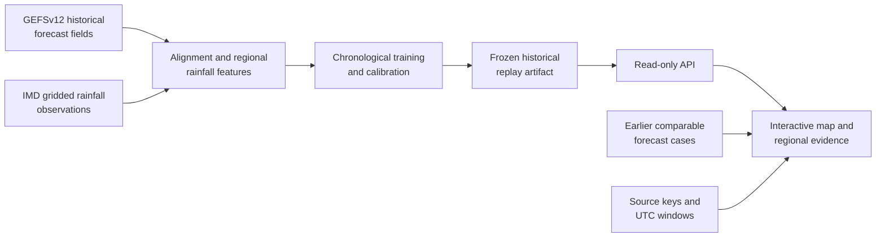

# Synoptiq

### A replayable view of where a rainfall forecast was most likely to be wrong

Built by HackTastic 6ix for Smart India Hackathon 2026 · SIH26079

[Presentation](submission/README.md#presentation) · [Demo video](submission/README.md#demo-video) · [Project reference](docs/SYNOPTIQ.md)

## What is Synoptiq?

Synoptiq is a research dashboard for examining the reliability of historical
medium-range rainfall forecasts over India. For each 2° land region and lead
day, it shows the probability that the forecast would have an unusually large
error—a **forecast bust**—along with the evidence behind that estimate.

It is a historical replay, not a live weather-warning service and not a source
of new forecasts.

## What can you explore?

- A map of bust risk across supported Indian land regions.
- Forecast rainfall, observed rainfall, and the region-specific bust threshold.
- Model-score evidence and earlier comparable forecast cases.
- The exact source window and provenance for each replayed result.
- Held-out evaluation results and a reliability diagram.

The included replay covers three held-out issue dates: **2018-01-01**,
**2019-01-01**, and **2019-12-31**. Days 1–9 are supported. Day 10 is
intentionally shown as unavailable because the source archive does not provide
the exact accumulation window required for an honest result.

## Run the replay

The repository includes the compressed historical replay bundle, so a normal
clone is enough to run the dashboard. No raw weather-data download is needed.

~~~bash
git clone https://github.com/kan9667/synoptiq.git
cd synoptiq
python3 -m venv .venv
source .venv/bin/activate
python -m pip install -e '.[dev]'
make web
make api
~~~

Open http://127.0.0.1:8000/ in a browser. The API documentation is available
at http://127.0.0.1:8000/docs.

## How to read a bust-risk result

A high probability does not mean heavy rain or a weather warning. It means the
forecast rainfall for that region and day was estimated to have a higher-than-
usual chance of being wrong by a large amount.

Synoptiq uses the GEFSv12 control forecast available at issue time and compares
it with IMD gridded rainfall after the verification window ends. A bust is an
absolute forecast error larger than a threshold learned from earlier years for
the same region, season, and lead range. Observations are used only for
historical verification, never as an input to the forecast-time score.

## Architecture

The replay is designed as a traceable chain from archived forecasts to an
interpretable regional result. Each served score retains its model, timing, and
source context.

The model is trained only on earlier periods. Once a forecast’s verification
window has ended, the matching IMD observation is used to assess the replayed
forecast—not to influence the score that was available at issue time.

## Results in this replay

The current reduced LightGBM model was evaluated on untouched 2018–2019 data:

| Model | Brier score |
| --- | ---: |
| Historical climatology baseline | 0.04359 |
| Synoptiq calibrated candidate | **0.03049** |

Lower is better. This is approximately a 30% lower Brier score than the
climatology baseline for the defined historical task. Read the full context,
including limits and methodology, in the [project reference](docs/SYNOPTIQ.md).

## Data and availability

The dashboard uses a reviewed, compressed replay artifact at
artifacts/replay/reduced_c00_replay.json.gz. It is small enough to be included
with the code and is read directly by the API.

The raw GEFSv12 and IMD source files are not included. They are only needed to
rebuild the training dataset or generate a new replay. See
[data/README.md](data/README.md) for the purpose of the empty data workspace.

## Repository guide

| Location | What you will find |
| --- | --- |
| web/ | The interactive dashboard. |
| src/bust/api/ | The read-only replay API. |
| artifacts/replay/ | The bundled historical replay and its metadata. |
| submission/ | Presentation and demo links. |
| docs/SYNOPTIQ.md | Methods, evidence, limitations, and project reference. |

## Scope and limitations

- Synoptiq is for historical research and demonstration, not operational use.
- It uses NOAA GEFSv12 reforecasts and IMD gridded rainfall; it is not validated
  for NCUM/NEPS operations.
- Its current model uses the c00 control member only.
- Scores are defined for regional rainfall forecast error, not impact or safety.

## Conclusion and impact

Synoptiq turns a broad archive of historical rainfall forecasts into a focused
question: *where should a forecaster look more closely?* Rather than presenting
certainty where none exists, it makes forecast reliability visible at the
regional level and accompanies each result with its evidence, comparable prior
cases, and provenance.

The project demonstrates a practical foundation for auditable forecast-quality
review in India. Its value lies in helping a reviewer prioritise attention,
understand uncertainty, and inspect the basis for a flagged result. It is a
research prototype, not a replacement for professional meteorological
judgement or an operational warning system.

## Team

Synoptiq was built by **HackTastic 6ix** for Smart India Hackathon 2026,
Problem Statement SIH26079.

| Team member | Contribution |
| --- | --- |
| **Kanishka Pandey** | Data lead: GEFS inventory, acquisition, decoding, accumulation audit, and source provenance. |
| **Aanya Varshney** | Verification lead: IMD decoding, land-region coverage, and rainfall labels. |
| **Rudraksh Saini** | Machine-learning lead: baselines, model training, calibration, and evaluation. |
| **Dhruv Makkar** | Features and explainability lead: issue-time features, analog retrieval, and model evidence. |
| **Aadi Jain** | Product lead: API, dashboard, and offline replay bundle. |
| **Triman Singh Chadha** | Integration and communications lead: acceptance, storyboard, presentation, and submission package. |

For source details, model design, evaluation records, and references, see the
[project reference](docs/SYNOPTIQ.md).
